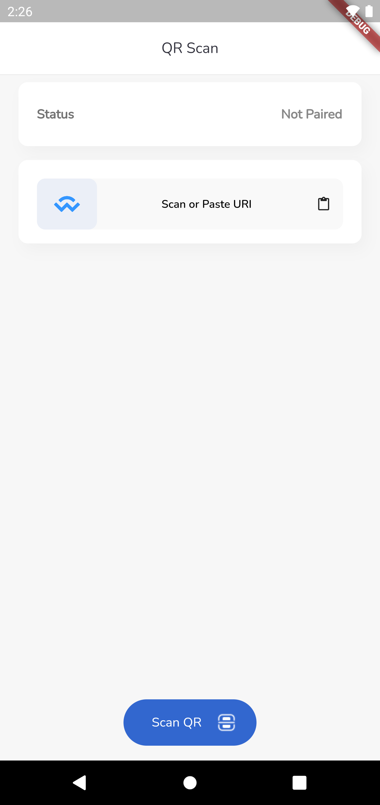
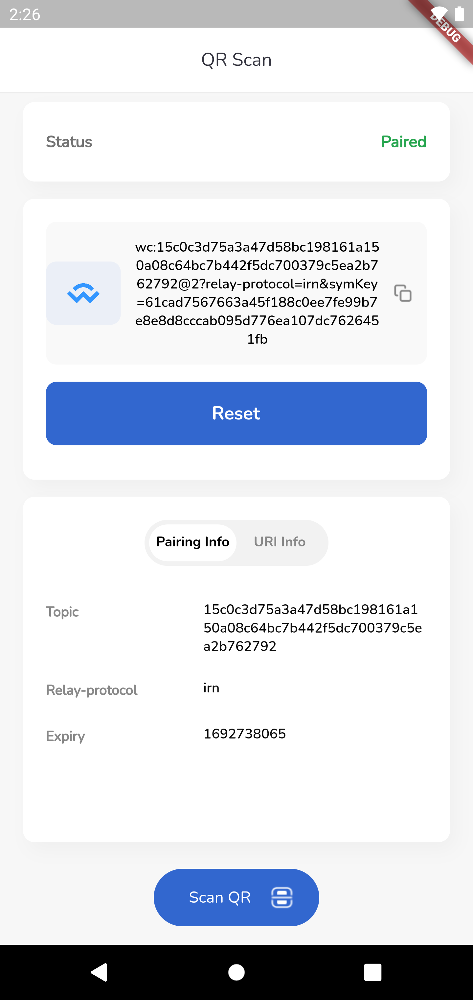

# WalletConnect QR_Scan


A walletconnect_flutter_v2 sample implementation project created in flutter using Bloc and GetIt. QR_Scan supports both web and mobile, clone the appropriate branches mentioned below:

* For Mobile & Web: https://github.com/karankharode/qr_scan_walletconnect (main channel)

## Getting Started

The  WalletConnect QR_Scan contains the minimal implementation required to create a pairing using Web3Wallet by WalletConnect. The code supports scanning of qr code or pasting of uri string to create a pair.
The repository code is preloaded with some basic components like basic app architecture, app theme, constants and required dependencies to create a new project. By using boiler plate code as standard initializer, we can have same patterns in all the projects that will inherit it. This will also help in reducing setup & development time by allowing you to use same code pattern and avoid re-writing from scratch.

## How to Use 

**Step 1:**

Download or clone this repo by using the link below:

```
https://github.com/karankharode/qr_scan_walletconnect
```

**Step 2:**

Go to project root and execute the following command in console to get the required dependencies: 

```
flutter pub get 
```

**Step 3:**

This project uses `get_it` library that works with code generation, execute the following command to generate files:

```
flutter packages pub run build_runner build --delete-conflicting-outputs
```

or watch command in order to keep the source code synced automatically:

```
flutter packages pub run build_runner watch
```

## Screenshots:

Not Paired State             |  Paired State
:-------------------------:|:-------------------------:
  |  
## Boilerplate Features:

* Splash
* Scan Screen
* Home Screen
* Routing
* Theme
* GetIt (to inject dependencies and create singleton classes)
* BLoC (State Management)
* Code Generation
* Dependency Injection
* Web3 Pairing (walletconnect_flutter_v2)
* Animation (Staggered)


### Libraries & Tools Used


* [BLoC](https://pub.dev/packages/bloc) (State Management)
* [Json Serialization](https://github.com/dart-lang/json_serializable)
* [Dependency Injection](https://github.com/fluttercommunity/get_it)
* [Staggered Animation](https://pub.dev/packages/flutter_staggered_animations)

### Folder Structure
Here is the core folder structure which flutter provides.

```
flutter-app/
|- android
|- build
|- ios
|- lib
|- test
```

Here is the folder structure we have been using in this project

```
lib/
|- bloc/
|- data/
|- di/
|- presentation/
|- router.dart
|- main.dart
```

Now, lets dive into the lib folder which has the main code for the application.

```
1- bloc - Contains the data layer of your project, includes directories for models and repositories
2- data - Contains bloc(s) for state-management of your application, to connect the business logic of your application with the UI
3- di - Contains dependency injection code 
4- presentation - all the ui of your project, contains sub directory for each screen, utils and widgets
5- router.dart — This file contains all the routes for your application.
6- main.dart - This is the starting point of the application. All the application level configurations are defined in this file i.e, theme, routes, title, orientation etc.

```


### BLoC

The BLoC is where all your business logic of your application and application state lives in flutter. The BLoC is basically a widget that stands at the top of the widget tree and passes it's data down using special methods. In-case of multiple blocs, a separate folder for each store is created as shown in the example below:

```
bloc/
|- pairing/
    |- pairing_bloc.dart
    |- pairing_event.dart
    |- pairing_state.dart
|- base_state.dart

```

### Data

All the business logic of your application will go into this directory, it represents the data layer of your application. It is sub-divided into three directories `model`, `repositories`. Each containing the domain specific logic. Since each layer exists independently, that makes it easier to unit test. The communication between UI and data layer is handled by using central repository.

```
data/
|- local/
    |- scanned_uri.dart
    
|- repositories/
    |- wallet_repository.dart

```

### Presentaion

This directory contains all the ui of your application. Each screen is located in a separate folder making it easy to combine group of files related to that particular screen. All the screen specific widgets will be placed in `widgets` directory as shown in the example below:

```
presentaion/
    |- screens
    |- utils
    |- widgets
    |- app.dart
    
screens/
   |- home/
      |- home_screen.dart
   |- intro/
      |- splash_screen.dart
   |- scan/
      |- scan_screen.dart

1- util — Contains the utilities/common functions of your application.
2- widgets — Contains the common widgets for your applications. For example, Button, TextField etc.
3- app.dart - Contains the entry point MaterialApp 
4- contains all the screens and ui code with sub directories for each screen

```

### Utils

This directory contains all the application level constants. A separate file is created for each type as shown in example below:

```
constants/
|- app_colors.dart
|- app_font.dart
|- app_dimens.dart
|- app_strings.dart
|- navigator_key.dart
...
```

### Unit Tests

test/
    |- wc_pair_test.dart

This directory contains the unit tests for WalletConnect Web3Wallet pair method. It takes mock uri data and created a pair using Web3Wallet instance.

The assertions check that the `PairingInfo.topic` and `PairingInfo.relay.protocol` match the
URI’s path and “relay-protocol” query parameter.

```
expect(pairingInfo.relay.protocol, scannedData.scannedRelayProtocol);
expect(pairingInfo.topic, scannedData.scannedTopic);
```


## Conclusion

I will be happy to answer any questions that you may have on this approach, and if you want to lend a hand with the project then please feel free to submit an issue and/or pull request 🙂

Again to note, this is example can appear as over-architectured for what it is - but it is an example only. If you liked my work, don’t forget to ⭐ star the repo to show your support.

